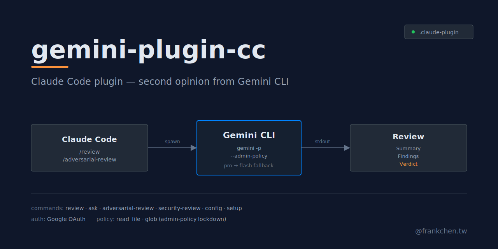

<p align="center">
  
</p>

# gemini-plugin-cc

[](LICENSE)
[](https://docs.anthropic.com/en/docs/claude-code/plugins)
[](https://github.com/google-gemini/gemini-cli)

A marketplace of [Claude Code plugins](https://docs.anthropic.com/en/docs/claude-code/plugins) that integrate [Gemini CLI](https://github.com/google-gemini/gemini-cli) — get a second opinion on code, and keep your prompt cache warm while reading images.

## Plugins

| Plugin | Purpose | Triggers |
|--------|---------|----------|
| [`gemini`](plugins/gemini/) | Slash commands for code review, ask, adversarial review, security review | `/gemini:*` |
| [`gemini-images`](plugins/gemini-images/) | PreToolUse hook that converts image Reads into text descriptions to protect prompt cache | Automatic on `Read` image files |

Both plugins share the same Gemini CLI OAuth credentials. Install one or both.

## Prerequisites

- [Claude Code](https://docs.anthropic.com/en/docs/claude-code/overview) installed
- [Gemini CLI](https://github.com/google-gemini/gemini-cli) installed (`npm install -g @google/gemini-cli`)
- `GEMINI_API_KEY` environment variable, or authenticated via `gemini` OAuth

Plugin-specific extra dependencies are listed in each plugin's README.

## Installation

```
/plugin marketplace add https://github.com/haunchen/gemini-plugin-cc
/plugin install gemini
/plugin install gemini-images
```

Restart Claude Code after installation.

For `gemini`, run `/gemini:setup` to verify.
For `gemini-images`, run `bash plugins/gemini-images/scripts/doctor.sh` to verify.

## Commands (gemini plugin)

- `/gemini:setup` — check CLI, version, OAuth
- `/gemini:review [path] [--model <m>]` — code review (default model: Pro with Flash fallback)
- `/gemini:ask <question> [file] [--model <m>]` — free-form technical question
- `/gemini:adversarial-review [path] [--model <m>]` — devil's advocate design challenge
- `/gemini:security-review [path] [--model <m>]` — OWASP-focused security review

## Security

The `gemini` plugin runs Gemini CLI with a read-only admin policy (`plugins/gemini/policies/readonly.toml`). Only `read_file` and `glob` are allowed; every other tool (including `run_shell_command`, `write_file`, `replace`, `web_fetch`, `web_search`, and any `mcp_*` tool) is denied.

This keeps the review / ask / adversarial-review / security-review commands focused on inspection. If you need Gemini to execute shell commands or modify files, invoke the `gemini` CLI directly instead of going through this plugin.

## Project Structure

```
gemini-plugin-cc/
├── .claude-plugin/
│   └── marketplace.json          # Marketplace registry
├── plugins/
│   ├── gemini/                   # Slash-command plugin
│   │   ├── .claude-plugin/plugin.json
│   │   ├── commands/
│   │   └── system-prompts/
│   └── gemini-images/            # PreToolUse hook plugin
│       ├── .claude-plugin/plugin.json
│       ├── hooks/
│       ├── system-prompts/
│       ├── scripts/doctor.sh
│       └── README.md
└── docs/
    ├── plans/                    # Design + implementation plans
    └── specs/                    # Feature specs
```

## License

MIT
