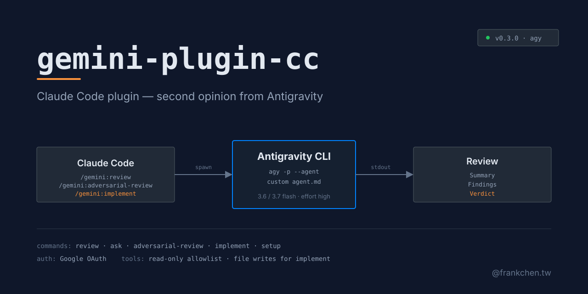

<p align="center">
  
</p>

# gemini-plugin-cc

[](LICENSE)
[](https://docs.anthropic.com/en/docs/claude-code/plugins)
[](https://antigravity.google)

> [!IMPORTANT]
> **Migrated from Gemini CLI to the Antigravity CLI (`agy`) as of v0.2.0.**
>
> Gemini CLI stopped serving consumer tiers on June 18, 2026 ([official notice](https://developers.google.com/gemini-code-assist/docs/deprecations/code-assist-individuals)) and now returns `IneligibleTierError`. Both plugins call `agy` instead, which requires **agy 1.1.6 or newer** for custom agent support.
>
> Two things changed for users:
>
> 1. **`/gemini:setup` is now required.** `agy` cannot take a system prompt per call, so setup installs the prompts into agy as agents. Skip it and the commands still run, but with no system prompt applied.
> 2. **`/gemini:security-review` was removed** — agy declines security-audit requests. See [Commands](#commands-gemini-plugin).
>
> `/gemini:review`, `/gemini:ask` and `/gemini:adversarial-review` work as before, with the same output and the same read-only restriction. Review quality is unchanged: 10/10 on the eval suite, the same score Gemini CLI got.

A marketplace of [Claude Code plugins](https://docs.anthropic.com/en/docs/claude-code/plugins) that bring Gemini into Claude Code via the [Antigravity CLI](https://antigravity.google) — get a second opinion on code, and keep your prompt cache warm while reading images.

## Plugins

| Plugin | Purpose | Triggers |
|--------|---------|----------|
| [`gemini`](plugins/gemini/) | Slash commands for code review, ask, adversarial review, implementation | `/gemini:*` |
| [`gemini-images`](plugins/gemini-images/) | PreToolUse hook that converts image Reads into text descriptions to protect prompt cache | Automatic on `Read` image files |

Both plugins share the same agy OAuth credentials. Install one or both.

## Prerequisites

- [Claude Code](https://docs.anthropic.com/en/docs/claude-code/overview)
- [Antigravity CLI](https://antigravity.google) **1.1.6 or newer** — older builds cannot load the custom agents these plugins install

`gemini-images` needs a few more tools (`jq`, Node.js, optionally tesseract and ImageMagick); see [its README](plugins/gemini-images/README.md#prerequisites).

## Setup

### 1. Install and sign in to agy

Install from [antigravity.google](https://antigravity.google), then check the version and authenticate:

```bash
agy --version          # must be >= 1.1.6
agy                    # run once interactively to sign in via Google OAuth, then quit
```

### 2. Install the plugins in Claude Code

```
/plugin marketplace add https://github.com/haunchen/gemini-plugin-cc
/plugin install gemini
/plugin install gemini-images
```

Restart Claude Code — plugins are not picked up until you do.

### 3. Install the agents into agy

This step is **required**, not a health check. `agy` cannot take a system prompt per call, so the prompts have to be registered with it up front. Without this the commands still run, but you get a generic answer with none of this repo's review structure.

For the `gemini` plugin, run the slash command — it installs the agents and verifies they took effect:

```
/gemini:setup
```

For `gemini-images`, install its agent from a clone of this repo:

```bash
git clone https://github.com/haunchen/gemini-plugin-cc
agy plugin install "$(pwd)/gemini-plugin-cc/plugins/gemini-images/agy"
```

Expect `agents : 1 processed`. Re-running either install upgrades in place.

### 4. Verify

```
/gemini:review
```

on a repo with uncommitted changes. A working install returns `## Review Summary` / `## Findings` / `## Verdict:`. Free-form prose with no such headings means the agent is not installed — see [Troubleshooting](#troubleshooting).

For `gemini-images`:

```bash
bash plugins/gemini-images/scripts/doctor.sh
```

All Required checks must pass. Optional warnings are fine for basic use but reduce quality.

## Troubleshooting

**`jetski: no output produced — a tool required the "read_file" permission...`**

The reviewer tried to open a file and agy auto-denied it, because a headless run cannot show a permission prompt. The denial discards the whole review, not just the tool call, so you get that one line where a report should be. The install is fine — `/gemini:setup` will not help.

Fixed in `gemini` v0.2.2, which grants the read with `--add-dir`; upgrade if you are older. If it still appears, the diff pointed at something outside the repository — a sibling checkout, a path reached through `..`. `/gemini:review` retries once without file-lookup capability and says so; findings about code outside the diff then come back as "not verifiable from this diff" rather than checked.

**Reviews come back as unstructured prose**

The agent is not installed. `agy --agent <name>` **silently ignores names it does not recognise** — it returns a normal-looking answer with exit code 0 and no warning, so a failed install is invisible until you notice the output has no `## Verdict:` line. Re-run `/gemini:setup` and check that step 4 reports `agents : 3 processed`.

**`Sorry, I cannot fulfill your request...`**

agy declines requests it reads as security auditing. This is why `/gemini:security-review` was removed. `/gemini:review` is not affected and still reports security defects.

**`IneligibleTierError`**

You are still on the old `gemini` CLI path. Gemini CLI stopped serving consumer tiers on June 18, 2026; upgrade to v0.2.0 of these plugins, which call `agy` instead.

**Auth errors, or the run hangs**

Run `agy` interactively once to refresh the OAuth token — `-p` (print) mode does not always refresh a stale one.

## Commands (gemini plugin)

- `/gemini:setup` — check agy, install the agents, verify they took effect
- `/gemini:review [path] [--spec <path>] [--model <m>]` — code review (default model: 3.6 Flash, high effort). `--spec` adds a spec-compliance verdict
- `/gemini:ask <question> [file] [--model <m>]` — free-form technical question
- `/gemini:adversarial-review [path] [--model <m>]` — devil's advocate design challenge
- `/gemini:implement <task> [--brief <path>] [--context <path>] [--model <m>]` — **writes to your files**. Default model: 3.7 Flash, high effort

> A `/gemini:security-review` command existed up to v0.1.0. It was removed in v0.2.0: agy declines security-audit requests (17 of 20 eval calls came back as "Sorry, I cannot fulfill your request to analyze or identify vulnerabilities"), even on a clean rename diff, so the command could not do its job. `/gemini:review` still flags security defects — it caught a SQL injection as `[HIGH]` on the same test case that the security command was refused on.

## Security

Each agent carries a `tools` whitelist in its frontmatter. For `gemini-review`, `gemini-ask` and `gemini-adversarial-review` it is `view_file` and `find_by_name` only — writing files, running shell commands, web access and MCP tools are absent from the toolset entirely, so there is nothing to bypass: the restriction holds even under `--dangerously-skip-permissions`. `/gemini:setup` verifies it on every run.

`gemini-implement` is the exception, and the reason it is a separate agent: it adds `replace_file_content` and `write_to_file`, because editing files is the job. It still has no shell — `/gemini:setup` step 7 confirms that specifically — so it cannot run tests, install packages, or reach the network. Tests it writes have never been executed, and it is required to say so rather than report them passing.

Two limits are worth knowing before using `/gemini:implement`:

- **`--add-dir` sets the workspace; it does not fence it.** Nothing in agy stops a write outside that path. `/gemini:implement` compensates by refusing to run outside a git repository, then reconciling the agent's declared file list against what `git status` actually shows — including files it changed without declaring. A write outside the repository root would not appear there, and nothing prevents one.
- **Read scope is unbounded for every agent, including the read-only ones.** The whitelist guarantees they cannot write; it says nothing about where they can read. In practice a review stays inside the repository root because its prompt tells it to, which is a behavioral constraint rather than a boundary.

Nothing commits. Leaving changes in the working tree is what keeps `git diff` and `git checkout` available as the review and undo path.

## Uninstall

```
/plugin uninstall gemini
/plugin uninstall gemini-images
```

The agents live in agy, not in Claude Code, so remove them separately or they stay behind:

```bash
agy plugin uninstall gemini-agents
agy plugin uninstall gemini-images-agents
```

## Project Structure

```
gemini-plugin-cc/
├── .claude-plugin/
│   └── marketplace.json          # Marketplace registry
├── plugins/
│   ├── gemini/                   # Slash-command plugin
│   │   ├── .claude-plugin/plugin.json
│   │   ├── commands/             # Claude Code slash commands
│   │   ├── agy/agents/           # System prompts, installed into agy
│   │   └── README.md
│   └── gemini-images/            # PreToolUse hook plugin
│       ├── .claude-plugin/plugin.json
│       ├── hooks/
│       ├── agy/agents/
│       ├── scripts/doctor.sh
│       └── README.md
└── docs/
    ├── plans/                    # Design + implementation plans
    └── specs/                    # Feature specs
```

## Changelog

See [CHANGELOG.md](CHANGELOG.md). `gemini` is at 0.2.2, `gemini-images` at 0.2.0; re-run `/gemini:setup` after upgrading `gemini` — prompt changes don't reach agy on their own, though from 0.2.1 the plugin tells you when they have drifted. 0.2.2 is the exception: it changes no prompts, so there is nothing to reinstall.

## License

MIT
